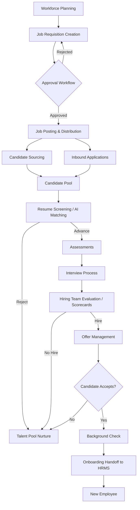

# AGENTS.md — LTI-IGR ATS Living Specification

> **Document type:** Living specification & strategic knowledge base
> **Owner:** LTI-IGR product strategy
> **Status:** v0.1 — Initial business & market analysis
> **Last updated:** 2026-05-23
> **Maintainer guidance:** This document is designed to grow. Add new sections at the bottom (see §11 Extension Guidelines). Keep each section self-contained so individual modules can be revised without breaking the rest.

---

## Table of Contents

1. [What is an ATS?](#1-what-is-an-ats)
2. [Core ATS Features](#2-core-ats-features)
3. [End-to-End Recruitment Workflow](#3-end-to-end-recruitment-workflow)
4. [Customer Value Proposition](#4-customer-value-proposition)
5. [Competitive Advantages of a Modern ATS](#5-competitive-advantages-of-a-modern-ats)
6. [Competitive Market Analysis](#6-competitive-market-analysis)
7. [Market Opportunity Assessment](#7-market-opportunity-assessment)
8. [Lean Canvas](#8-lean-canvas)
9. [Revenue Model Analysis](#9-revenue-model-analysis)
10. [Strategic Recommendations](#10-strategic-recommendations)
11. [Extension Guidelines](#11-extension-guidelines)

---

## 1. What is an ATS?

### Definition
An **Applicant Tracking System (ATS)** is a software platform that automates and centralizes the end-to-end recruitment process — from job requisition creation and candidate sourcing through screening, interviewing, offer management, and handoff to onboarding. It acts as the **system of record for hiring**.

### Primary Purpose
- Centralize all candidate data, communications, and hiring activity in one place.
- Standardize, automate, and accelerate the hiring workflow.
- Provide structured data for hiring decisions and compliance reporting.

### Business Problems Solved
| Problem | How ATS solves it |
|---|---|
| Fragmented candidate data across email, spreadsheets, job boards | Single source of truth |
| Slow time-to-hire and lost candidates | Automated pipeline progression and reminders |
| Inconsistent evaluation and bias | Structured scorecards and interview kits |
| Compliance risk (EEOC, GDPR, OFCCP) | Audit trails, consent management, DEI reporting |
| Low recruiter productivity | Automation, templates, parsing, bulk actions |
| Poor candidate experience | Branded career sites, timely communication |

### Typical Users & Customer Segments
- **Users:** Recruiters, hiring managers, HRBPs, talent ops, executives, interviewers, candidates.
- **Segments:** SMBs (1–200 employees), Mid-Market (200–2,000), Enterprise (2,000+), Staffing & RPO agencies.

### Market Evolution (last decade)
- **2015–2018:** Cloud-first SaaS replaces on-prem; mobile-friendly career sites become standard.
- **2018–2021:** API-first platforms emerge (Greenhouse, Lever); structured hiring methodology popularized.
- **2021–2023:** Pandemic accelerates remote hiring, video interviewing, async assessments, candidate-experience focus.
- **2023–2026:** Generative AI transforms sourcing, screening, matching, and candidate communication; talent intelligence and skills-based hiring become differentiators; consolidation around all-in-one platforms (Ashby, Rippling).

### ATS vs Adjacent Categories
| Category | Primary scope | Core user | Key data |
|---|---|---|---|
| **ATS** | Pre-hire workflow (req → offer) | Recruiter | Candidates, jobs, stages |
| **Recruiting CRM** | Passive talent nurturing, pipeline marketing | Sourcer | Leads, campaigns, talent pools |
| **HRMS** | Core HR admin (payroll, benefits, records) | HR ops | Employees |
| **HCM** | Full employee lifecycle (HRMS + performance + L&D + comp) | CHRO | Employees, org data |
| **Talent Acquisition Platform** | ATS + CRM + onboarding + analytics | TA leader | End-to-end talent funnel |

---

## 2. Core ATS Features

For each capability: **Purpose · Customer Value · Business Impact**.

### 2.1 Job Requisition Management
| Capability | Purpose | Customer Value | Business Impact |
|---|---|---|---|
| Job requisition creation | Formalize hiring intent | Single intake form | Demand visibility |
| Job description management | Versioned, reusable JDs | Consistent employer voice | Faster posting, better SEO |
| Approval workflows | Multi-stage sign-off | Governance & budget control | Prevents unbudgeted hires |
| Hiring request management | Capture manager needs | Reduces back-and-forth | 30–50% faster req cycle |
| Headcount planning support | Tie reqs to plan | Budget alignment | Forecast accuracy |
| Job templates | Reuse role definitions | Save time | Standardization |

### 2.2 Job Posting & Distribution
| Capability | Purpose | Customer Value | Business Impact |
|---|---|---|---|
| Job posting creation | Publish openings | Reach more candidates | Higher applicant volume |
| Career site publishing | Branded hub | Better candidate experience | +20–40% direct applicants |
| Multi-job-board distribution | One-click syndication | Reach (LinkedIn, Indeed, niche) | Lower cost-per-applicant |
| Social recruiting | Share on LinkedIn/FB/X | Passive reach | Employer brand |
| Internal job postings | Internal mobility | Retention | Lower external hire cost |
| Employer branding customization | Themes, media | Differentiation | Quality of applicants |

### 2.3 Candidate Sourcing
| Capability | Purpose | Customer Value | Business Impact |
|---|---|---|---|
| Talent pool management | Silver-medalist reuse | Faster sourcing | Lower CPH |
| Sourcing tools (Chrome ext, search) | Find passive talent | Recruiter reach | Pipeline depth |
| Employee referral programs | Tap network | High-quality leads | Referrals = ~40% of best hires |
| Talent pipeline development | Pre-build benches | Speed for critical roles | Time-to-fill ↓ |
| Candidate import | LinkedIn/CSV/email | No data loss | Adoption acceleration |

### 2.4 Candidate Management
| Capability | Purpose | Customer Value | Business Impact |
|---|---|---|---|
| Resume/CV parsing | Auto-extract structured data | No re-typing | 5–10x faster intake |
| Tagging & segmentation | Organize talent | Reusability | Pool monetization |
| Activity history | Full audit trail | Context for every touch | Compliance + UX |
| Advanced search & filters | Boolean / semantic | Find right talent fast | Recruiter productivity |
| Talent database management | Long-term asset | Compounding value | Reduce future sourcing cost |

### 2.5 Screening & Evaluation
| Capability | Purpose | Customer Value | Business Impact |
|---|---|---|---|
| Application screening | Filter unqualified | Time saved | Funnel quality |
| Knockout questions | Auto-disqualify mismatches | Less noise | Recruiter focus |
| Candidate-job matching (AI) | Rank fit | Better top-of-funnel | Quality of hire ↑ |
| Skills assessments | Validate ability | Reduce bias | Better hires |
| Technical assessments (coding) | Engineering hiring | Reduce false positives | Eng productivity |
| Psychometric testing | Cultural/behavioral fit | Reduce mis-hires | Retention |
| Scorecards | Structured evaluation | Fair comparison | Defensible decisions |

### 2.6 Interview Management
| Capability | Purpose | Customer Value | Business Impact |
|---|---|---|---|
| Interview scheduling | Auto-coordination | Hours saved/week | -60–80% coord time |
| Calendar sync (G/O365) | Real-time availability | No double-booking | Speed |
| Interview kits | Prep + questions | Consistency | Quality |
| Structured interviews | Standardized rubric | Reduce bias | Predictive validity |
| Collaborative feedback | Shared scorecards | Alignment | Better decisions |
| Video interview integrations | Zoom/Teams/async | Remote-friendly | Global reach |

### 2.7 Communication & Engagement
| Capability | Purpose | Customer Value | Business Impact |
|---|---|---|---|
| Automated email workflows | Stage-triggered comms | Never ghost candidates | NPS ↑ |
| Nurturing campaigns | Drip to passive | Pipeline building | Future hire pool |
| SMS/messaging | Higher open rates | Faster response | Time-to-hire ↓ |
| Interview reminders | Reduce no-shows | Predictable schedule | Productivity |
| Status notifications | Transparency | Candidate trust | Employer brand |

### 2.8 Workflow Automation
| Capability | Purpose | Customer Value | Business Impact |
|---|---|---|---|
| Hiring workflow automation | Codify process | Consistency at scale | Scalability |
| Stage progression rules | Auto-advance | Less manual work | Speed |
| Approval automation | Routing rules | Faster decisions | Time-to-fill |
| Task automation | Tickler/reminders | Nothing falls through | Reliability |
| Recruiter productivity tools | Bulk actions, hotkeys | Power-user efficiency | Cost-per-hire ↓ |

### 2.9 Analytics & Reporting
| Capability | Purpose | Customer Value | Business Impact |
|---|---|---|---|
| Recruitment dashboards | At-a-glance health | Visibility | Faster action |
| Hiring funnel analytics | Stage conversion | Identify bottlenecks | Throughput |
| Source-of-hire | ROI per channel | Reallocate spend | -20–40% sourcing cost |
| Time-to-hire | Process efficiency | Benchmark | SLA management |
| Time-to-fill | Demand satisfaction | Capacity planning | Revenue protection |
| Cost-per-hire | Unit economics | Budget defense | CFO alignment |
| Recruiter performance | Team productivity | Coaching | Team optimization |
| DEI reporting | Equity tracking | Compliance + ESG | Brand & legal |

---

## 3. End-to-End Recruitment Workflow

### Lifecycle Stages
1. **Workforce planning** — headcount + skills forecast.
2. **Job requisition creation** — hiring manager intake.
3. **Approval workflow** — finance/HR/exec sign-off.
4. **Job posting & distribution** — career site + boards + social.
5. **Candidate sourcing** — inbound + outbound + referrals.
6. **Application submission** — branded apply flow.
7. **Resume screening** — AI/manual filter.
8. **Assessments** — skills, technical, psychometric.
9. **Interview process** — phone → panel → final.
10. **Hiring team evaluation** — scorecards, debrief.
11. **Offer management** — generation, approval, e-sign.
12. **Candidate acceptance** — background check.
13. **Hiring & onboarding handoff** — to HRMS.

### Mermaid Diagram

---

## 4. Customer Value Proposition

### By Segment
| Segment | Primary pain | Key value | Typical KPIs |
|---|---|---|---|
| **SMBs (1–200)** | No process, founder-led hiring | Simple, affordable, fast setup | Time-to-hire <30d, $/hire <$3K |
| **Mid-Market (200–2K)** | Scaling chaos, manager enablement | Standardization + collaboration | TTH 25–40d, recruiter ratio 1:50 |
| **Enterprise (2K+)** | Compliance, global complexity, integrations | Governance, DEI, HRIS integration | Cost-per-hire, DEI %, SLA |
| **Staffing/RPO agencies** | High req volume, candidate-as-product | Throughput, candidate ownership, billing | Submissions/day, placement rate |

### Benefits & Industry Benchmarks
| Benefit | Typical improvement |
|---|---|
| Reduced Time-to-Hire | -30 to -50% (e.g., 42 → 25 days) |
| Reduced Time-to-Fill | -20 to -40% |
| Lower Cost-per-Hire | -25 to -40% (industry avg ~$4,700; SHRM) |
| Recruiter Productivity | 2–3x more reqs per recruiter |
| Candidate Experience (NPS) | +20 to +40 points |
| Quality of Hire (1-yr retention) | +10 to +20% |
| Compliance | Audit-ready trails, EEO/GDPR/OFCCP |
| Employer Brand | +25% direct applicants via career site |
| Process Standardization | Structured hiring boosts predictive validity 2x (Schmidt & Hunter) |
| Scalability | Support 10x volume without linear headcount |

---

## 5. Competitive Advantages of a Modern ATS

| Competitive Advantage | Customer Value | Business Impact | Implementation Complexity |
|---|---|---|---|
| **General AI (copilot, drafting)** | Recruiter time savings | -30% admin time | Medium (LLM + prompt eng) |
| **AI-powered candidate matching** | Better shortlists | Quality of hire ↑ | High (data + ML ops) |
| **Workflow automation engine** | Codify any process | Scalability | Medium-High |
| **UX (consumer-grade)** | Adoption, NPS | Lower churn | Medium |
| **Open APIs / webhooks** | Ecosystem fit | Enterprise winnable | Medium |
| **Advanced analytics / BI** | Data-driven decisions | C-suite stickiness | Medium |
| **Talent intelligence (market data)** | Strategic insight | Premium tier | High (data partnerships) |
| **Recruitment marketing (CRM)** | Pipeline building | Higher LTV | High |
| **Marketplace ecosystem** | Plug-and-play integrations | Network effects, moat | High |
| **Omnichannel engagement** | Reach candidates anywhere | Conversion | Medium |
| **Employer branding tools** | Differentiation | Direct sourcing ↑ | Low-Medium |
| **Data-driven hiring (structured)** | Predictive validity | Better hires | Low (methodology) |

---

## 6. Competitive Market Analysis

| Platform | Target Segment | Core Strengths | Core Weaknesses | Pricing | Positioning | Key Differentiators |
|---|---|---|---|---|---|---|
| **Greenhouse** | Mid-Market & Enterprise tech | Structured hiring methodology, integrations marketplace, scorecards | Cost, learning curve, dated UI in places | $6.5K–$25K+/yr (per-employee tiers) | "Hiring done right" | Methodology, ecosystem |
| **Lever** | Mid-Market | ATS + CRM unified, sourcing | Slower innovation post-Employ acquisition | Custom quote, ~$4K+/yr | TRM (Talent Relationship Mgmt) | Native CRM |
| **Workable** | SMB & Mid-Market | Ease of use, AI sourcing, fast setup | Less depth at enterprise | $169–$599+/mo per job slots | "Hire smarter, faster" | AI sourcing, job-slot pricing |
| **Teamtailor** | SMB & Mid-Market (EMEA) | Career site + employer branding, design-led UX | Less powerful analytics | Custom quote, mid-tier | Employer-brand-led ATS | Career-site-first |
| **Recruitee** | SMB & Mid-Market (EU) | Collaborative hiring, simple UX | Smaller ecosystem | $199–$479+/mo | Collaborative hiring | Visual pipelines, team focus |
| **SmartRecruiters** | Enterprise | Global scale, marketplace, compliance | Complex implementation | Custom quote, $$$$ | "Hiring success platform" | Enterprise + marketplace |
| **Ashby** | High-growth startups & scale-ups | Unified ATS+CRM+Analytics+Scheduling, modern UX, deep analytics | Newer brand, fewer integrations | ~$400+/mo per recruiter | All-in-one for ambitious teams | Best-in-class analytics, unified product |

---

## 7. Market Opportunity Assessment

### Market Size & Growth
- **Global ATS market:** ~$3.2B in 2024, projected ~$5.0B by 2029 (CAGR ~8–10%).
- **Global HRTech market:** ~$40B in 2024, projected ~$80B by 2030 (CAGR ~12%).
- **Recruitment software (broad):** ~$10B+ when including CRM, assessments, video.

### Trends
- AI/Generative AI as primary buying driver (2024–2026).
- Skills-based hiring replacing degree filters.
- Internal mobility as a first-class workflow.
- Consolidation: buyers want fewer vendors, all-in-one suites.
- Programmatic job advertising and pay-for-performance.
- Candidate experience as a competitive battleground.

### Challenges
- AI bias and regulatory scrutiny (NYC Local Law 144, EU AI Act).
- Data privacy (GDPR, CCPA, candidate consent).
- Integration sprawl (HRIS, calendars, assessments, background checks).
- Legacy ATS lock-in (Taleo, iCIMS).

### Innovation Opportunities
- Agentic AI recruiters (autonomous sourcing & screening).
- Skills graphs + internal mobility.
- Vertical ATS (healthcare, manufacturing, hourly).
- Conversational candidate experience (WhatsApp, SMS).
- Real-time labor market intelligence embedded in flows.

### Barriers to Entry
- Integration ecosystem (HRIS, job boards, assessments).
- Enterprise procurement (SOC2, ISO 27001, SSO, audit).
- Brand trust and proof points (logos, case studies).
- Data network effects of incumbents.

### Most Attractive Initial Segments
| Segment | Why attractive |
|---|---|
| **Tech startups & scale-ups** | High urgency, modern stack, willing to pay, viral references |
| **SMBs** | Underserved by enterprise tools, simple needs, low CAC |
| **Recruitment agencies** | High volume, per-seat economics, retention sticky |
| **Professional services** | Constant hiring, structured roles |
| **Manufacturing (hourly)** | Underserved, high volume, mobile-first |
| **International hiring orgs** | Multi-region complexity = high willingness to pay |

---

## 8. Lean Canvas

| Block | Content |
|---|---|
| **Problem** | (1) Hiring is slow, fragmented across tools. (2) Recruiters waste 60%+ of time on admin. (3) Bias and inconsistent evaluations hurt quality. (4) Candidate experience is poor; top talent drops off. (5) Leaders lack real-time hiring analytics. |
| **Customer Segments** | Primary: high-growth tech companies (50–500 employees). Secondary: SMBs (10–50), staffing agencies. Early adopters: AI-forward Heads of Talent. |
| **Unique Value Proposition** | "The AI-native ATS that hires faster, fairer, and with less work — your recruiters keep the strategy, the AI handles the busywork." |
| **Solution** | AI copilot for every recruiter task: sourcing, screening, scheduling, comms, scorecards. Unified ATS+CRM+Analytics. Modern UX. Open API. |
| **Channels** | Product-led growth (free tier), SEO + content (recruiter community), partnerships (HRIS, payroll), conferences (HR Tech, Unleash), founder/recruiter Slack & LinkedIn. |
| **Revenue Streams** | Per-recruiter SaaS ($150–$400/mo); AI add-on ($50–$100/seat); enterprise license; marketplace rev-share (assessments, job boards). |
| **Cost Structure** | Engineering (40%), AI/LLM infra (15%), GTM/Sales (25%), CS (10%), G&A (10%). |
| **Key Metrics** | Activation (first hire created in 7 days), reqs per account, recruiter MAU, NRR ≥120%, CAC payback <12mo, gross margin >75%. |
| **Unfair Advantage** | Proprietary candidate-fit model trained on outcome data; founding team's recruiter network; integration depth; brand as "AI-native" first mover. |

---

## 9. Revenue Model Analysis

| Model | Advantages | Disadvantages | Scalability | Ideal ICP | Recommended Use |
|---|---|---|---|---|---|
| **Per recruiter (seat)** | Predictable, aligned with value, easy to sell | Caps expansion as automation reduces seats | High | Mid-market, agencies | Default core model |
| **Per active employee** | Scales with customer growth, sticky | Misaligned for hiring-heavy/low-headcount orgs | Very High | Enterprise, HCM-bundled | Enterprise tier |
| **Per requisition** | Aligned with usage | Volatile revenue, gameable | Medium | Project-based hiring | Add-on overage |
| **Per job posting (slots)** | Simple, transparent | Disincentivizes posting; volume games | Medium | SMB | SMB entry tier |
| **Subscription SaaS** | ARR, predictable, valuation-friendly | Requires retention discipline | Very High | All | Foundation |
| **Freemium** | Massive top-of-funnel, PLG | Conversion hard; infra cost | High | SMB, startups | Acquisition lever |
| **Enterprise license** | Large ACV, multi-year | Long sales cycle, customization | Medium | Enterprise (2K+) | Upmarket motion |
| **Usage-based (AI calls)** | Captures heavy-user value | Bill shock risk | High | AI-heavy users | AI add-on |
| **Marketplace / integration rev** | Network effects, high margin | Requires ecosystem scale first | Very High (later) | Mature platform | Year 2+ |
| **Premium AI add-ons** | Captures willingness to pay for AI | Risk of commoditization | High | All | Now — high pricing power |

**Recommended blend:** Per-recruiter subscription (base) + AI add-on (expansion) + marketplace rev-share (long-tail margin) + enterprise licensing (upmarket).

---

## 10. Strategic Recommendations

### Minimum Viable Feature Set (to be credible in 2026)
- Job req creation + approval, career site, multi-board distribution.
- Resume parsing, candidate database, advanced search.
- Pipeline/Kanban, scorecards, structured interviews.
- Calendar-integrated scheduling.
- Email + SMS templates and automation.
- Core analytics (funnel, time-to-hire, source).
- AI copilot: JD drafting, candidate summaries, ranking, outreach drafting.
- SSO, SOC2, GDPR, role-based permissions.
- Open API + Zapier + key integrations (Gmail/O365, Zoom/Teams, LinkedIn, Indeed, HRIS).

### Table Stakes
Career sites, parsing, scheduling, scorecards, multi-board posting, SOC2, mobile-friendly candidate apply.

### Sustainable Differentiators
1. **Agentic AI recruiter** — autonomous sourcing + screening + outreach with human-in-the-loop.
2. **Best-in-class analytics & talent intelligence** — benchmarks vs market.
3. **Unified ATS + CRM + Scheduling + Analytics** (no Frankenstack).
4. **Recruiter-grade UX** — keyboard-first, fast, opinionated.
5. **Outcome-trained matching model** with feedback loop.

### Recommended Initial Segment
**High-growth tech companies (50–500 employees)** — willingness to pay, AI-friendly, viral references, expansion potential into mid-market.

### Pricing Strategy
- **Starter** $149/recruiter/mo (3 seat min) — core ATS.
- **Growth** $299/recruiter/mo — automation, analytics, integrations.
- **AI add-on** +$79/seat/mo — copilot, matching, agents.
- **Enterprise** custom — SSO/SCIM, audit, advanced DEI, dedicated CSM.
- Free 14-day trial; free "Solo" tier (1 seat, 3 active jobs) as PLG funnel.

### 24-Month Product Roadmap
| Quarter | Focus |
|---|---|
| Q1 | MVP: reqs, career site, candidate DB, parsing, pipeline, scorecards, basic AI copilot, SOC2 Type I |
| Q2 | Scheduling, multi-board posting, email/SMS automation, analytics v1, top 10 integrations |
| Q3 | AI matching v1, talent CRM, referral program, mobile candidate app |
| Q4 | Agentic sourcing, advanced analytics, DEI reporting, SOC2 Type II, SSO/SCIM |
| Q5 | Marketplace launch, partner program, vertical templates (tech, agency) |
| Q6 | Talent intelligence (market data), internal mobility module |
| Q7 | Enterprise-grade governance, multi-entity, global compliance (EU AI Act, LL144) |
| Q8 | Outcome model v2 (trained on hire/retention data), embedded benchmarks |

### Go-to-Market Strategy
- **PLG core:** free Solo tier + self-serve Starter.
- **Sales-assisted:** Growth tier via inbound + outbound to Heads of Talent at 50–500 emp tech cos.
- **Enterprise:** field sales year 2+, partner-led (HRIS resellers).
- **Content & community:** recruiter playbooks, benchmarks reports, podcast.
- **Partnerships:** Rippling/Gusto/Deel app stores, assessment vendors, job boards.
- **Events:** HR Tech, Unleash, RecFest.

### Key Risks & Mitigation
| Risk | Mitigation |
|---|---|
| Incumbent price war | Differentiate on AI + UX; don't compete on price |
| AI regulation (EU AI Act, NYC LL144) | Build explainability + bias audits from day one |
| LLM cost spikes | Multi-model strategy, caching, fine-tuned small models |
| Long enterprise sales cycle | Start PLG/mid-market; enterprise year 2+ |
| Integration sprawl | Prioritize top 20; open API for long tail |
| Talent (eng + recruiter SMEs) | Hire ex-recruiter PMs; remote-first |
| Data privacy breach | SOC2 + ISO 27001 + pen tests; data residency options |
| AI commoditization | Own outcome data flywheel; agentic workflows as moat |

---

## 11. Extension Guidelines

This document is a **living specification**. To add new sections, follow these conventions:

### Where to add
- **New analytical modules** (e.g., §12 Technical Architecture, §13 Data Model, §14 Security & Compliance, §15 AI/ML Strategy, §16 Personas, §17 User Journeys, §18 KPI Tree, §19 Risk Register): append in numerical order.
- **Updates to existing sections:** edit in place; bump the document version at the top.

### Conventions
- Use H2 (`##`) for top-level sections, H3 (`###`) for subsections.
- Prefer **tables** for comparative data.
- Use **Mermaid** for diagrams (flowcharts, sequence, ER, C4).
- Each section should be self-contained; cross-reference with anchor links.
- Date every update at the top (`Last updated`) and add a changelog entry below as the doc matures.

### Suggested future sections
- §12 Technical Architecture & Tech Stack
- §13 Domain & Data Model (entities, relationships)
- §14 Security, Privacy & Compliance Framework
- §15 AI/ML Strategy & Responsible AI Guardrails
- §16 User Personas & Jobs-to-be-Done
- §17 Detailed User Journeys (recruiter, hiring manager, candidate)
- §18 KPI Tree & North Star Metric
- §19 Risk Register & Issue Log
- §20 Integrations Catalog
- §21 Localization & Internationalization Plan
- §22 Pricing & Packaging Detail
- §23 Sales Playbook
- §24 Customer Success Playbook
- §25 Changelog

### Changelog
| Version | Date | Author | Change |
|---|---|---|---|
| 0.1 | 2026-05-23 | LTI-IGR | Initial strategic & market analysis (sections 1–10) |
