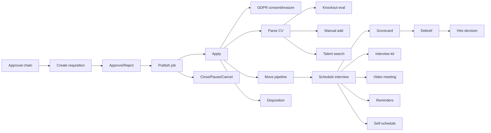

# Product Backlog — LTI-IGR (AI-native Applicant Tracking System)

> **Source user stories:** [`user-stories/`](user-stories/) · **Stories analyzed:** 21 (all P0 / MVP) · **PRD:** [`README_PRD.md`](README_PRD.md)
> **Technique:** MoSCoW + Eisenhower (value × urgency) for ordering, T-shirt sizing (S/M/L) for cost, dependency-driven sequencing.
> **Status:** Living document — re-evaluate every sprint as estimates firm up and stakeholder feedback arrives.

---

## 1. Analysis summary

LTI-IGR is an AI-native ATS whose core value loop is the hiring funnel: a role is **opened** (requisition → approval → published job), **filled** with applicants (apply → CV parsing → knockout screening → pipeline), and **converted** into a hire (interview scheduling → scorecards → debrief → decision). The 21 analyzed user stories span the three MVP domains — **Requisitions & Job Posting** (5), **Candidate Application & Screening** (8), and **Interviews & Hire Decision** (8) — and involve eight human actors (Hiring Manager, Approver, Recruiter, Admin/Talent Ops, Candidate, Interviewer, DPO) plus the System/AI agent behind the automations.

Because all 21 stories are flagged **P0 (must-have for MVP)** in the source, prioritization here is **not about dropping work** — it is about the **correct delivery order**. The dominant ordering force is therefore **dependencies**: the funnel is a chain, and each story unlocks the next. A secondary force is **risk burn-down** — the highest-risk integrations (AI CV parsing, calendar OAuth, GDPR erasure) are pulled forward within their tier so uncertainty is resolved early rather than at the end of the funnel. Business value and urgency are uniformly high across the set, so they mainly break ties between stories at the same dependency depth.

Each story below is scored against the seven prioritization factors, assigned a MoSCoW bucket (**Must** = on the minimum end-to-end "open → hire" path or legally mandatory; **Should** = P0 enhancement that can ship slightly later within the same release without breaking the funnel), and placed in a single, fully-ordered list. Where a judgment was made on stakeholders' behalf, it is listed under **Assumptions** (§6).

---

## 2. Prioritization criteria

| Factor | How it was applied |
|---|---|
| **Business value** | Impact on the funnel's ability to open roles, capture applicants, and produce hires; retention/attractiveness/revenue proxy. |
| **Urgency** | Whether the story gates downstream work or carries a market/legal commitment. |
| **Dependencies** | Enablers and funnel-upstream stories rank above what they unlock (hard ordering constraint). |
| **Implementation cost** | T-shirt size (S ≈ ≤2d, M ≈ 3–5d, L ≈ >1 sprint or external integration). Best cost/benefit wins ties. |
| **Risks & blockers** | Third-party integrations, AI accuracy, public-facing surfaces, and regulatory exposure. High-risk items pulled forward within their tier. |
| **User feedback** | Weight given to UX-critical, candidate-/interviewer-facing surfaces. |
| **Technological maturity** | Feasibility/maturity of the underlying tech (CRUD = high; AI parsing & integrations = medium). |

**Process framing.** This ordering is the proposed input to a **stakeholder review** (Hiring leadership + DPO confirm the legal/compliance Musts) and a **team prioritization session** (Planning Poker to firm up the S/M/L estimates, Eisenhower matrix to validate the value × urgency tie-breaks). It is **iterative**: priorities and estimates should be revisited each sprint as real velocity and user feedback emerge.

---

## 3. Prioritization matrix

Scale: **H/M/L** per factor; Cost as T-shirt size (lower = cheaper).

| # | Story | Business value | Urgency | Dependency role | Cost | Risk | User-feedback weight | Tech maturity |
|---|---|---|---|---|---|---|---|---|
| 1 | Configure the requisition approval chain | M | H | Enabler (REQ-01, REQ-02) | M | L | L | H |
| 2 | Create a requisition from a template | H | H | Funnel origin | M | L | M | H |
| 3 | Approve or reject a requisition | H | H | Gates publication | S | L | L | H |
| 4 | Publish a job to the career site | H | H | Opens the funnel | M | M | M | H |
| 5 | Close, pause, or cancel a requisition | M | M | Lifecycle hygiene | S | L | L | H |
| 6 | Apply to a job | H | H | Funnel entry; triggers parse+knockout | M | M | H | H |
| 7 | Manage GDPR consent & right-to-be-forgotten | H | H | Legal gate on all PII | L | **H** | M | M |
| 8 | Automatically parse CVs into structured fields | H | H | Feeds search, screening | L | **H** | M | M |
| 9 | Evaluate knockout questions automatically | H | H | Filters applicants | M | M | M | H |
| 10 | Move a candidate across pipeline stages | H | H | Enables interviews | S | L | M | H |
| 11 | Disposition a candidate with a reason & email | M | M | Candidate comms / audit | S | M | H | H |
| 12 | Manually add a candidate | M | M | Sourcing intake | S | L | M | H |
| 13 | Search & filter the talent database | M | M | Reusable talent asset | L | M | M | H |
| 14 | Schedule an interview with calendar sync | H | H | Gates all interview stories | L | **H** | M | M |
| 15 | Submit a structured scorecard | H | H | Feeds debrief | M | M | H | H |
| 16 | Run a collaborative debrief | H | H | Feeds hire decision | M | M | H | H |
| 17 | Record the hire / no-hire decision | H | H | Funnel conversion point | S | L | M | H |
| 18 | Send an interview kit to interviewers | M | M | Interview prep | M | L | M | H |
| 19 | Provision a video meeting | M | M | Remote access (manual fallback) | M | M | M | H |
| 20 | Send automated interview reminders | M | M | No-show reduction | S | L | L | H |
| 21 | Candidate self-schedules / reschedules | M | M | Reduces drop-off | M | M | H | H |

---

## 4. Prioritized backlog

Ordered highest → lowest priority. Order respects dependencies (every enabler precedes its dependents); within a dependency tier, higher-risk and higher-value stories come first.

| # | UC ID | User story | Actor | Value | Depends on | Cost | Risk | MoSCoW |
|---|---|---|---|---|---|---|---|---|
| 1 | UC-REQ-10 | [Configure the requisition approval chain](user-stories/configure-approval-chain.md) | Admin / Talent Ops | Governed approval routing — enabler for the whole Requisitions domain | — | M | L | **Must** |
| 2 | UC-REQ-01 | [Create a requisition from a template](user-stories/create-requisition-from-template.md) | Hiring Manager | Funnel origin; fast, compliant headcount request | UC-REQ-10 | M | L | **Must** |
| 3 | UC-REQ-02 | [Approve or reject a requisition](user-stories/approve-or-reject-requisition.md) | Approver | Headcount-spend governance before any job goes live | UC-REQ-01, UC-REQ-10 | S | L | **Must** |
| 4 | UC-REQ-03 | [Publish a job to the career site](user-stories/publish-job-to-career-site.md) | Recruiter | First candidate-facing artifact; opens the funnel | UC-REQ-02 | M | M | **Must** |
| 5 | UC-CAND-01 | [Apply to a job](user-stories/apply-to-a-job.md) | Candidate | Funnel entry point — creates the application | UC-REQ-03 | M | M | **Must** |
| 6 | UC-CAND-12 | [Manage GDPR consent & right-to-be-forgotten](user-stories/gdpr-consent-and-erasure.md) | Candidate / DPO | Mandatory legal compliance on all captured PII | UC-CAND-01 | L | **H** | **Must** |
| 7 | UC-CAND-02 | [Automatically parse CVs into structured fields](user-stories/auto-parse-cv.md) | Recruiter (System) | Eliminates manual entry; enables search & screening | UC-CAND-01 | L | **H** | **Must** |
| 8 | UC-CAND-03 | [Evaluate knockout questions automatically](user-stories/evaluate-knockout-questions.md) | Recruiter (System) | Filters unqualified applicants without manual effort | UC-CAND-01, UC-CAND-02 | M | M | **Must** |
| 9 | UC-CAND-09 | [Move a candidate across pipeline stages](user-stories/move-candidate-pipeline-stage.md) | Recruiter | Core daily workflow; unlocks interviews | UC-CAND-01 | S | L | **Must** |
| 10 | UC-CAND-10 | [Disposition a candidate with a reason & email](user-stories/reject-candidate-with-reason.md) | Recruiter | Consistent candidate comms; compliant audit trail | UC-CAND-01 | S | M | Should |
| 11 | UC-CAND-06 | [Manually add a candidate](user-stories/manually-add-candidate.md) | Recruiter | Brings sourced/referred talent into the pipeline | UC-CAND-02 (soft) | S | L | Should |
| 12 | UC-CAND-07 | [Search & filter the talent database](user-stories/search-talent-database.md) | Recruiter | Turns the database into a reusable talent asset | UC-CAND-02 | L | M | Should |
| 13 | UC-INT-01 | [Schedule an interview with calendar sync](user-stories/schedule-interview-calendar-sync.md) | Recruiter | Removes scheduling overhead; gates all interview work | UC-CAND-09 | L | **H** | **Must** |
| 14 | UC-INT-06 | [Submit a structured scorecard](user-stories/submit-structured-scorecard.md) | Interviewer | Consistent, comparable, bias-mitigated evidence | UC-INT-01 | M | M | **Must** |
| 15 | UC-INT-07 | [Run a collaborative debrief](user-stories/collaborative-debrief.md) | Hiring Manager + Panel | Calibration reduces bias, improves decision quality | UC-INT-06 | M | M | **Must** |
| 16 | UC-INT-08 | [Record the hire / no-hire decision](user-stories/record-hire-decision.md) | Hiring Manager | Funnel conversion point — applications become hires | UC-INT-07 | S | L | **Must** |
| 17 | UC-INT-03 | [Send an interview kit to interviewers](user-stories/send-interview-kit.md) | Interviewer (System) | Prepared, structured, fair interviews | UC-INT-01 | M | L | Should |
| 18 | UC-INT-05 | [Provision a video meeting](user-stories/provision-video-meeting.md) | Recruiter (System) | Frictionless remote access (manual link fallback) | UC-INT-01 | M | M | Should |
| 19 | UC-INT-04 | [Send automated interview reminders](user-stories/automated-interview-reminders.md) | Recruiter (System) | Lowers no-show rate | UC-INT-01 | S | L | Should |
| 20 | UC-INT-02 | [Candidate self-schedules / reschedules](user-stories/candidate-self-schedule-interview.md) | Candidate | Reduces friction and drop-off | UC-INT-01 | M | M | Should |
| 21 | UC-REQ-07 | [Close, pause, or cancel a requisition](user-stories/close-pause-cancel-requisition.md) | Recruiter | Keeps postings and reporting accurate | UC-REQ-03 | S | L | Should |

> **Note on ordering:** UC-REQ-07 (close/pause/cancel) depends only on publication (UC-REQ-03) and could ship as early as rank 5, but as lifecycle *hygiene* rather than funnel-advancing work it is sequenced last so the team completes one full vertical "open → hire" slice before circling back. Move it up if open requisitions accumulate in production sooner than expected.

---

## 5. Dependency view & recommended roadmap

### Dependency graph (critical path in bold logic)

### Suggested releases / iterations

| Release | Theme | Stories (ranks) | Rationale |
|---|---|---|---|
| **R1 — Open the role** | Requisitions go live | 1–4 (REQ-10, 01, 02, 03) | The funnel cannot start until a job is published. Pure CRUD + governance, low risk — good warm-up that delivers the first candidate-facing artifact. |
| **R2 — Fill the funnel** | Capture & screen applicants | 5–9 (CAND-01, 12, 02, 03, 09) | Apply flow plus the two highest-risk items (GDPR erasure, AI CV parsing) are tackled here to burn down uncertainty early; knockout + pipeline movement complete a usable screening loop. |
| **R3 — Convert to hires** | Interviews & decision | 13–16 (INT-01, 06, 07, 08) | Minimum end-to-end path from scheduling to a recorded hire. INT-01 (calendar OAuth) is the last high-risk integration. After R3 the product can take a role from open to hire. |
| **R4 — Round out P0** | Enhancements & hygiene | 10–12, 17–21 (CAND-10, 06, 07; INT-03, 05, 04, 02; REQ-07) | Remaining P0 "Should" stories that improve UX, sourcing, comms, and reporting accuracy. Parallelizable; each can ship independently once its enabler (CAND-02 / INT-01 / REQ-03) is live. |

> The R4 items are only "later" relative to the critical path — they are still **P0 for MVP** and should all ship before launch. Within R2–R4, candidate-/interviewer-facing surfaces (apply, self-schedule, scorecard, disposition email) warrant early **usability feedback** since they carry the highest user-feedback weight.

---

## 6. Assumptions (made on stakeholders' behalf — confirm in review)

- **All 21 stories are in-scope for MVP launch.** MoSCoW *Should* here means "can ship slightly later within the release," **not** "can be cut." Confirm with product leadership before treating any as deferrable.
- **GDPR (UC-CAND-12) is a hard launch blocker** for any EU-facing deployment — pulled into R2 ahead of convenience features. DPO to confirm erasure-completeness requirements.
- **AI CV parsing (UC-CAND-02) and calendar sync (UC-INT-01) are the top technical risks** and are front-loaded in their tiers; both have medium tech maturity (LLM accuracy / third-party OAuth). Spike/validate early.
- **Video provisioning (UC-INT-05) has a manual-link fallback**, so it is sequenced after the core interview path rather than blocking it.
- Estimates (S/M/L) are placeholders for a **Planning Poker** session; re-baseline once the team has confirmed velocity.

---

*This backlog is dynamic. Re-evaluate ranks, MoSCoW buckets, and estimates at each sprint boundary as new data (velocity, user feedback, stakeholder commitments) emerges.*
