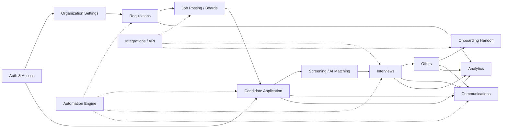

# LTI-IGR · Use Case Catalog

> **Type:** Living specification — functional analysis of the ATS
> **Source of requirements:** [`../AGENTS.md`](../AGENTS.md)
> **Last updated:** 2026-05-23
> **Structure:** every domain folder contains a `spec.md` (functional analysis & use cases) and a `design.md` (data model: entities, attributes, ER diagram). This README is the master index of roles, dependencies and use cases.

---

## 1. User Roles

| # | Role | Description | Typical scope |
|---|---|---|---|
| R1 | **Admin / Talent Ops** | Configures tenant, RBAC, templates, integrations, employer brand, workflows. | Whole organization |
| R2 | **Recruiter** | Operational owner of the hiring process. Creates requisitions, posts jobs, sources, screens, schedules, communicates. | Multi-requisition |
| R3 | **Hiring Manager** | Requests the role, defines the profile, reviews shortlists, makes hire decisions. | Their team |
| R4 | **Interviewer** | Conducts interviews and submits scorecards. | Assigned slots |
| R5 | **Approver (Finance / HR Exec)** | Approves requisitions, headcount and offers. | Per policy |
| R6 | **Sourcer** | Builds passive talent pipeline and nurtures pools. | Multiple reqs |
| R7 | **Candidate** | Applies to jobs, manages profile, self-schedules interviews, signs offer. | External |
| R8 | **System / AI Agent** | Runs automations (CV parsing, candidate-job matching, reminders, agentic sourcing). | Cross-cutting |
| R9 | **Auditor / DPO** | Reads audit trails, exports compliance evidence (GDPR/EEO/OFCCP). | Read-only |

---

## 2. Functional Domains

| Domain | Spec | Primary responsibility |
|---|---|---|
| **auth** | _pending_ | Identity, sessions, SSO, RBAC, invitations (foundational, not a core funnel use case) |
| **organization** | _pending_ | Tenants, teams, employer brand, settings |
| **requisitions** | [spec.md](requisitions/spec.md) · [design.md](requisitions/design.md) | Requisition lifecycle, approval, career-site publication, multi-board distribution |
| **candidates** | [spec.md](candidates/spec.md) · [design.md](candidates/design.md) | Application, CV parsing, knockout, AI matching, talent database, pipeline |
| **sourcing** | _pending_ | Talent pools, referrals, campaigns, agentic sourcing |
| **assessments** | _pending_ | Technical, skills, and psychometric assessments (integration-led) |
| **interviews** | [spec.md](interviews/spec.md) · [design.md](interviews/design.md) | Scheduling, interview kits, scorecards, debrief, hire decision |
| **communications** | _pending_ | Email/SMS templates, automation, nurture campaigns |
| **offers** | _pending_ | Offer generation, approval, e-signature |
| **onboarding-handoff** | _pending_ | Handoff to HRMS/HRIS |
| **analytics** | _pending_ | Dashboards, hiring funnel, DEI, time-to-X metrics |
| **integrations** | _pending_ | APIs, webhooks, marketplace, HRIS connectors |
| **automation** | _pending_ | Workflow rules, triggers, tasks |

---

## 3. Master Use Case Catalog (MVP)

IDs: `UC-<domain>-<n>`. Priority: **P0** = must-have for MVP, **P1** = first release, **P2** = post-MVP.

### 3.1 Auth & Access
| ID | Use case | Primary actor | Priority |
|---|---|---|---|
| UC-AUTH-01 | Sign up new organization (tenant) | Admin | P0 |
| UC-AUTH-02 | Sign in with email + password | Internal users | P0 |
| UC-AUTH-03 | Sign in with SSO (Google / Microsoft / SAML) | Internal users | P1 |
| UC-AUTH-04 | Invite team member with role | Admin | P0 |
| UC-AUTH-05 | Accept invitation and complete profile | Invitee | P0 |
| UC-AUTH-06 | Reset password | Internal users | P0 |
| UC-AUTH-07 | Enable MFA | Internal users | P1 |
| UC-AUTH-08 | Manage RBAC (roles & permissions) | Admin | P0 |
| UC-AUTH-09 | Candidate self-registration | Candidate | P0 |
| UC-AUTH-10 | Revoke access / deactivate user | Admin | P1 |

### 3.2 Requisitions & Job Posting
| ID | Use case | Actor | Priority |
|---|---|---|---|
| UC-REQ-01 | Create requisition from template | Hiring Manager | P0 |
| UC-REQ-02 | Approve requisition | Approver | P0 |
| UC-REQ-03 | Publish job to career site | Recruiter | P0 |
| UC-REQ-04 | Distribute to job boards (LinkedIn, Indeed, niche) | Recruiter | P1 |
| UC-REQ-05 | Close / pause requisition | Recruiter | P0 |

### 3.3 Candidates
| ID | Use case | Actor | Priority |
|---|---|---|---|
| UC-CAND-01 | Candidate applies to a job | Candidate | P0 |
| UC-CAND-02 | Auto-parse CV / resume | System | P0 |
| UC-CAND-03 | Manually add candidate | Recruiter | P0 |
| UC-CAND-04 | Search / filter talent database | Recruiter | P0 |
| UC-CAND-05 | Tag & segment candidate | Recruiter | P1 |
| UC-CAND-06 | Move candidate across pipeline stages | Recruiter | P0 |
| UC-CAND-07 | Reject candidate with reason + email | Recruiter | P0 |
| UC-CAND-08 | Add to talent pool | Sourcer | P1 |
| UC-CAND-09 | GDPR consent & right-to-be-forgotten | Candidate / DPO | P0 |

### 3.4 Screening & Evaluation
| ID | Use case | Actor | Priority |
|---|---|---|---|
| UC-SCR-01 | Apply knockout questions | System | P0 |
| UC-SCR-02 | AI candidate-job match scoring | System | P1 |
| UC-SCR-03 | Send technical / skills assessment | Recruiter | P1 |

### 3.5 Interviews
| ID | Use case | Actor | Priority |
|---|---|---|---|
| UC-INT-01 | Schedule interview (calendar sync) | Recruiter | P0 |
| UC-INT-02 | Candidate self-schedules / reschedules | Candidate | P0 |
| UC-INT-03 | Send interview kit to interviewer | System | P0 |
| UC-INT-04 | Submit structured scorecard | Interviewer | P0 |
| UC-INT-05 | Collaborative debrief & hire decision | Hiring Manager | P0 |
| UC-INT-06 | Automated reminders (24h, 1h) | System | P0 |

### 3.6 Offers & Onboarding
| ID | Use case | Actor | Priority |
|---|---|---|---|
| UC-OFF-01 | Generate offer letter from template | Recruiter | P0 |
| UC-OFF-02 | Approve offer | Approver | P0 |
| UC-OFF-03 | E-sign offer | Candidate | P1 |
| UC-OFF-04 | Handoff new hire to HRMS | System | P1 |

### 3.7 Analytics & Compliance
| ID | Use case | Actor | Priority |
|---|---|---|---|
| UC-AN-01 | Hiring funnel dashboard | Recruiter / Admin | P0 |
| UC-AN-02 | Time-to-hire / cost-per-hire report | Admin | P1 |
| UC-AN-03 | DEI / EEO report | Admin / Auditor | P1 |
| UC-AN-04 | Export audit evidence | Auditor | P1 |

---

## 4. Dependency Map

---

## 5. Three Core Use Cases (with diagram)

The three flows below form the **core value loop** of an ATS and gate every other downstream capability:

| # | Core use case | Spec | Rationale |
|---|---|---|---|
| 1 | **Requisition → Job Posting & Multi-Board Distribution** | [requisitions/spec.md](requisitions/spec.md) | Origin of the hiring funnel. Without an approved, published, distributed requisition no candidate enters the system. First "wow" moment of the product. |
| 2 | **Candidate Application & Screening (parsing + AI matching)** | [candidates/spec.md](candidates/spec.md) | Heart of the funnel and the recruiter's biggest productivity win — what differentiates a modern ATS from a spreadsheet. |
| 3 | **Interview Scheduling, Scorecard & Hire Decision** | [interviews/spec.md](interviews/spec.md) | Point where applications convert into hires. Biggest lever on time-to-hire and quality-of-hire. |

> **Note on Auth:** Authentication, RBAC and invitations are P0 and mandatory, but they are **enabling infrastructure**, not a core business use case. They are tracked in the `auth` domain (spec pending) and listed in §3.1 of this catalog.

---

## 6. Spec Conventions

Every domain `spec.md` follows this minimum structure:

1. **Domain summary** (what it solves, in scope, out of scope).
2. **Roles involved**.
3. **Use case list** (table with ID, priority, dependencies).
4. **Detailed use case(s)** (actor, preconditions, main flow, alternative flows, postconditions, business rules, data model).
5. **Mermaid diagram(s)** (sequence or flow).
6. **Cross-cutting business rules**.
7. **Published events** (for integrations / analytics).
8. **Open questions**.

---

## 7. Changelog

| Version | Date | Change |
|---|---|---|
| 0.1 | 2026-05-23 | Initial roles, domain map and MVP use case catalog. Detailed specs for auth, candidates, interviews. |
| 0.2 | 2026-05-23 | Translated all specs to English using standard ATS/HRTech terminology. |
| 0.3 | 2026-05-23 | Replaced the three core-use-case specs with the actual top-3 business flows: requisitions, candidates (incl. screening + AI matching), interviews (incl. hire decision). Auth demoted to enabling infrastructure. |
