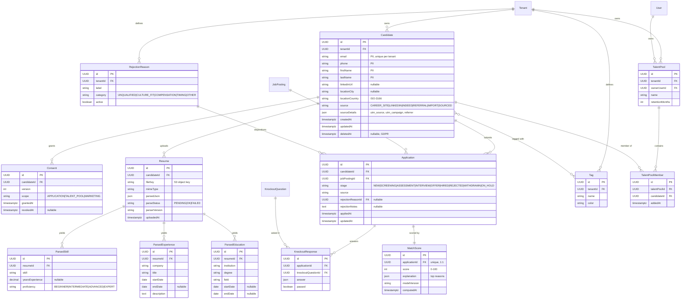

# Domain: Candidate Application & Screening — `design.md`

> **Companion to:** [`spec.md`](spec.md)
> **Scope:** data model (entities, attributes, relationships) for the Candidates domain.
> **Last updated:** 2026-05-23

---

## 1. Conventions

- **Identifiers:** every entity has `id : UUID` (PK). Foreign keys named `<entity>Id`.
- **Multi-tenancy:** every top-level entity carries `tenantId : UUID`.
- **Timestamps:** `createdAt`, `updatedAt` (TIMESTAMPTZ, UTC).
- **Soft delete:** `deletedAt : TIMESTAMPTZ?` on entities subject to GDPR right-to-be-forgotten.
- **Enums:** rendered as inline comments; persisted as constrained strings or DB enums.
- **Cardinality (Mermaid ER):** `||--o{` 1-to-many · `||--||` 1-to-1 · `}o--o{` many-to-many.
- **PII** is flagged in field comments.

---

## 2. Referenced Cross-Cutting Entities

Owned by other domains, referenced (FK only) here.

| Entity | Owner | Why referenced |
|---|---|---|
| `Tenant` | platform | Multi-tenancy boundary. |
| `User` | platform | Recruiter, sourcer, talent-pool owner. |
| `JobPosting` | [requisitions](../requisitions/design.md) | Target of `Application`. |
| `KnockoutQuestion` | [requisitions](../requisitions/design.md) | Question being answered by `KnockoutResponse`. |

---

## 3. Domain Entities

| Entity | Description |
|---|---|
| `Candidate` | Person who has applied or been sourced into the talent database. |
| `Consent` | Versioned GDPR consent records. |
| `Resume` | Uploaded CV with parsed JSON payload. |
| `ParsedSkill` / `ParsedExperience` / `ParsedEducation` | Structured extraction from the resume. |
| `Application` | One candidate's application to one job posting. |
| `KnockoutResponse` | Candidate's answer to one knockout question. |
| `MatchScore` | AI candidate-job fit score with explainability (1:1 with `Application`). |
| `Tag` / `CandidateTag` | Free-form segmentation. |
| `RejectionReason` | Configurable taxonomy of disposition reasons. |
| `TalentPool` / `TalentPoolMember` | Curated groups of candidates for nurturing. |

---

## 4. ER Diagram

---

## 5. Key Cardinality Rules

| Relation | Cardinality | Note |
|---|---|---|
| `Candidate → Application` | 1 : N | A candidate can apply to many roles. |
| `JobPosting → Application` | 1 : N | A posting can receive many applications. |
| `Candidate → Resume` | 1 : N | History of uploaded CVs; latest used for matching. |
| `Application → MatchScore` | 1 : 1 | Latest score only (history is P2). |
| `Application → KnockoutResponse` | 1 : N | One per knockout question. |
| `Candidate ↔ Tag` | M : N | Free-form segmentation. |
| `Candidate ↔ TalentPool` | M : N | Via `TalentPoolMember`. |

---

## 6. Lifecycle Invariants

1. `Candidate.email` is unique within a `tenantId`.
2. `Consent` is mandatory before `Application` may exist in regulated jurisdictions; consent revocation does not delete prior `Application` rows but anonymizes `Candidate` PII.
3. `Application.stage` follows the standard pipeline `NEW → SCREENING → ASSESSMENT → INTERVIEW → OFFER → HIRED`, with `REJECTED | WITHDRAWN | ON_HOLD` as terminal/branch states.
4. `MatchScore` never auto-rejects an `Application` (compliance with NYC LL144, EU AI Act). It is decision support only.
5. `Candidate.deletedAt` (GDPR) anonymizes PII fields but preserves the `Application` chain for audit (with PII redacted).

---

## 7. Boundary with Other Domains

- **Inbound:** `JobPosting.id` and `KnockoutQuestion.id` from [requisitions/design.md](../requisitions/design.md).
- **Outbound:** `Application.id` is consumed by `Interview` and `HireDecision` in [interviews/design.md](../interviews/design.md).
- **Outbound:** `Application.stage = OFFER` triggers the `offers` domain (out of MVP scope).

---

## 8. Open Questions

- Score history vs. latest only: store latest `MatchScore` plus a `MatchScoreHistory` child for model-drift analysis (P2).
- Voluntary EEO / DEI self-ID data: store in a separate access-controlled entity (`CandidateEEO`) never joined to the hiring decision path. Proposed for P1.
- Multi-language CV parsing coverage matrix — informs `parserVersion` semantics.
- Hard delete vs. anonymize for GDPR — legal review pending per jurisdiction.
