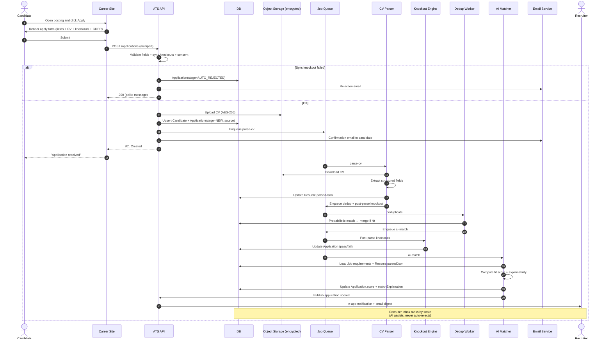

# Domain: Candidate Application & Screening — `spec.md`

> **Source of requirements:** [`../../AGENTS.md`](../../AGENTS.md) · [Master catalog](../README.md)
> **Last updated:** 2026-05-23

---

## 1. Domain Summary

Owns the **conversion of an applicant into a qualified candidate**: public apply flow, CV/resume parsing, knockout questions, AI candidate-job matching, deduplication, and pipeline progression. This is the **heart of the hiring funnel** and the recruiter's main productivity battleground.

**In scope:**
- Public candidate application via the career site (apply flow).
- Automatic CV/resume parsing (PDF, DOCX) into structured fields.
- Knockout questions (server-side evaluation).
- AI candidate-job match scoring (fit score with explainability).
- Deduplication and merge of candidate profiles.
- Talent database: search, filters, tags, segments.
- Pipeline / Kanban board: stage progression and dispositioning.
- Talent pool management for silver-medalists.
- GDPR consent capture and right-to-be-forgotten handling.

**Out of scope:** technical / coding assessments and psychometric tests (handled by `assessments` integrations), interview scheduling (domain `interviews`), offer management (domain `offers`).

---

## 2. Roles Involved

| Role | Capabilities |
|---|---|
| Candidate | Apply, manage profile, grant / withdraw consent |
| Recruiter | Import, search, advance / disposition, tag, manage talent pools |
| Hiring Manager | Review shortlist for their reqs, leave comments, request additional screening |
| Sourcer | Import passive candidates, add to talent pools, run outreach |
| System / AI | CV parsing, deduplication, knockout evaluation, candidate-job match scoring |
| DPO / Auditor | Export / anonymize per consent policy |

---

## 3. Use Cases in this Domain

| ID | Use case | Actor | Priority | Depends on |
|---|---|---|---|---|
| UC-CAND-01 | Apply to a job | Candidate | P0 | UC-REQ-03 |
| UC-CAND-02 | Auto-parse CV / resume | System | P0 | UC-CAND-01 |
| UC-CAND-03 | Evaluate knockout questions | System | P0 | UC-CAND-01 |
| UC-CAND-04 | AI candidate-job match scoring | System | P1 | UC-CAND-02 |
| UC-CAND-05 | Deduplicate / merge candidate profile | System | P1 | UC-CAND-02 |
| UC-CAND-06 | Manually add candidate | Recruiter | P0 | — |
| UC-CAND-07 | Search / filter talent database | Recruiter | P0 | UC-CAND-02 |
| UC-CAND-08 | Tag / segment candidate | Recruiter | P1 | UC-CAND-01 |
| UC-CAND-09 | Move across pipeline stages | Recruiter | P0 | UC-CAND-01 |
| UC-CAND-10 | Disposition / reject with reason + email | Recruiter | P0 | UC-CAND-01 |
| UC-CAND-11 | Add to talent pool | Sourcer | P1 | UC-CAND-01 |
| UC-CAND-12 | GDPR consent / right-to-be-forgotten | Candidate / DPO | P0 | UC-CAND-01 |

---

## 4. Detailed Use Case — UC-CAND-01 → UC-CAND-04: Apply, parse, screen, score

**Primary actor:** Candidate
**Secondary actors:** System (parser, knockout engine, AI matcher), Recruiter (notification consumer)

### Preconditions
- Job posting is live on career site (`UC-REQ-03`) and not past its close date.
- Tenant has configured an application form, knockout questions (optional), and an AI matching profile (optional).

### Main flow
1. Candidate browses the career site, opens the posting and clicks **Apply**.
2. System renders the apply form: name, email, phone, work authorization, CV upload, **knockout questions**, optional voluntary EEO/DEI self-ID (US), and **GDPR consent** checkbox (EU).
3. Candidate uploads CV (PDF / DOCX, ≤10 MB) and completes required fields.
4. (Optional) "Apply with LinkedIn" or "Apply with Indeed" pre-fills the profile via OAuth.
5. System validates file type, size, knockout answers and consent server-side.
6. System creates / updates `Candidate` and creates `Application(stage = NEW, source = utm_source)`.
7. System uploads CV to encrypted object storage and enqueues **asynchronous parsing**.
8. System sends confirmation email + status-tracking link to the candidate.
9. UI shows "Application received" success page.

#### Asynchronous pipeline (post-submit)
10. **Parser worker** extracts structured fields (contact, work history, skills, education, certifications, locations) and stores them on `Resume.parsedJson`.
11. **Deduplication worker** runs probabilistic matching (email, phone, name + DOB, CV hash, LinkedIn URL). On hit → merges into existing `Candidate` and links the new `Application`.
12. **Knockout engine** re-evaluates against parsed data (e.g., "minimum 5 years X experience" parsed from CV vs. self-declared).
13. **AI Matcher** computes a **fit score** (0–100) against the job's requirements (skills overlap, experience level, location compatibility) and produces an **explainability payload** (top reasons for the score).
14. System updates `Application.score` and `Application.matchExplanation`.
15. System notifies the owning Recruiter (in-app + digest email) with the candidate ranked in the inbox by fit score.

### Alternative flows
- **A1. Knockout failed (sync)** → `Application.stage = AUTO_REJECTED`, automated rejection email with templated reason.
- **A2. CV unreadable / parser failure** → flag "Parser failed — review manually" on recruiter UI; do not block the application.
- **A3. Duplicate candidate** → merge into existing profile and surface "Previously applied to N roles" badge to recruiter.
- **A4. Missing GDPR consent** → block submission with explanation.
- **A5. Apply with LinkedIn / Indeed** → skip CV upload (optional), populate from OAuth profile and parsed LinkedIn data.
- **A6. Low fit score** → still surfaced to recruiter (never auto-rejected by AI alone, to mitigate bias and comply with NYC Local Law 144 / EU AI Act).
- **A7. Candidate withdraws** → `Application.stage = WITHDRAWN`, retain in talent pool per consent.

### Postconditions
- `Candidate` and `Application` persisted with source attribution.
- CV stored encrypted at rest with `parsedJson` indexed for search.
- Events published to the internal bus (downstream: notifications, analytics, automation).
- Application appears in recruiter inbox, ranked by fit score.

### Business rules
- **Email uniqueness** per candidate within a tenant (cross-tenant isolation enforced).
- **GDPR consent** is mandatory in EU, versioned (consent version + timestamp persisted).
- **Default retention:** 24 months after last activity (configurable per tenant / jurisdiction).
- **Knockout questions** evaluated server-side; never trust the client.
- **AI matching is decision support, not decision automation** — score never auto-rejects a candidate (compliance with NYC LL144, EU AI Act high-risk classification).
- **PII** encrypted at rest (AES-256); logs must never contain PII; access audited.
- **Voluntary EEO data** stored in a separate, access-controlled store and never visible to hiring decision-makers.

### Key data model
```
Candidate {
  id, tenantId, email, phone, name, source, sourceDetails{utm, referrer},
  consent{version, grantedAt, scope}, createdAt, updatedAt
}
Application {
  id, candidateId, jobId, stage, source, rejectionReason?,
  score?, matchExplanation?, createdAt, updatedAt
}
Resume {
  id, candidateId, fileKey, mimeType, parsedJson, parseStatus, parserVersion
}
KnockoutResponse { applicationId, questionId, answer, passed }
TalentPool { id, name, ownerId, candidateIds[], retentionPolicy }
```

---

## 5. Diagram (Mermaid) — Apply → Parse → Knockout → AI Match → Recruiter Inbox



---

## 6. Cross-Cutting Business Rules

- **Standard pipeline stages:** `New → Screening → Assessment → Interview → Offer → Hired` (+ `Rejected`, `Withdrawn`, `On Hold`).
- **Stage progression** requires role permission and triggers communication templates and analytics events.
- **Dispositioning** always carries a reason from a configurable taxonomy plus a templated email.
- **Talent pool:** rejected or silver-medalist candidates can be added to a pool with explicit extended-retention consent.
- **Search:** full-text (OpenSearch) + structured filters (skills, location, experience, stage, source, tags, fit score).
- **Bias mitigation:** AI scores never auto-reject; explainability is mandatory; periodic bias audits per EU AI Act.

---

## 7. Published Events

| Event | Typical consumers |
|---|---|
| `application.created` | Notifications, Analytics, Automation |
| `application.parsed` | Matcher, Search index |
| `application.scored` | Recruiter inbox, Analytics |
| `application.stage.changed` | Communications (templates), Analytics |
| `application.rejected` | Communications, Talent Pool |
| `application.withdrawn` | Communications, Analytics |
| `candidate.consent.revoked` | DPO, Data lifecycle worker |
| `candidate.merged` | Search index, Analytics |

---

## 8. Open Questions

- Allow apply without a CV (LinkedIn profile only)? Proposal: yes, configurable per posting.
- AI scoring cadence: sync lightweight + batch reranking? Proposal: both — sync coarse score on submit, async deep reranking nightly.
- Self-service candidate portal: should candidates see their fit score? Proposal: no (gameable + EU AI Act explainability burden).
- Multi-language CV parsing coverage matrix.
