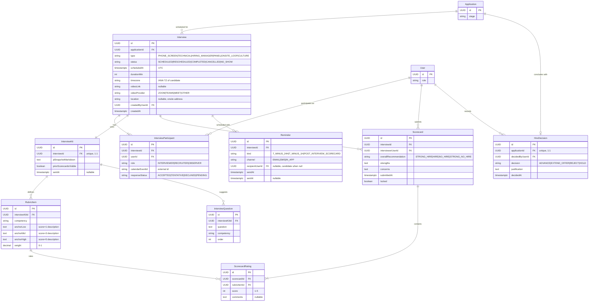

# Domain: Interviews & Hire Decision — `design.md`

> **Companion to:** [`spec.md`](spec.md)
> **Scope:** data model (entities, attributes, relationships) for the Interviews domain.
> **Last updated:** 2026-05-23

---

## 1. Conventions

- **Identifiers:** every entity has `id : UUID` (PK). Foreign keys named `<entity>Id`.
- **Multi-tenancy:** scoped indirectly via `Application → JobPosting → Requisition.tenantId`.
- **Timestamps:** `createdAt`, `updatedAt` (TIMESTAMPTZ, UTC). All scheduling stored in UTC.
- **Enums:** rendered as inline comments; persisted as constrained strings or DB enums.
- **Cardinality (Mermaid ER):** `||--o{` 1-to-many · `||--||` 1-to-1 · `||--|{` 1-to-one-or-many · `||--o|` 1-to-zero-or-one.

---

## 2. Referenced Cross-Cutting Entities

Owned by other domains, referenced (FK only) here.

| Entity | Owner | Why referenced |
|---|---|---|
| `User` | platform | Interviewer, recruiter, hiring manager, decision-maker. |
| `Application` | [candidates](../candidates/design.md) | The application being interviewed. |

---

## 3. Domain Entities

| Entity | Description |
|---|---|
| `Interview` | A scheduled interview event tied to an `Application`. |
| `InterviewParticipant` | A user attached to an interview (interviewer, recruiter, observer). |
| `InterviewKit` | Materials sent to interviewers for a specific interview (1:1 with `Interview`). |
| `RubricItem` | One competency in the rubric, with anchor descriptions. |
| `InterviewQuestion` | A suggested question in the kit. |
| `Scorecard` | An interviewer's structured evaluation submitted post-interview. |
| `ScorecardRating` | Per-competency rating inside a scorecard. |
| `Reminder` | Scheduled reminder (24h, 1h, post-interview scorecard). |
| `HireDecision` | Final decision recorded by the Hiring Manager after debrief. |

---

## 4. ER Diagram

---

## 5. Key Cardinality Rules

| Relation | Cardinality | Note |
|---|---|---|
| `Application → Interview` | 1 : N | Phone → Technical → Panel → HM. |
| `Interview → InterviewParticipant` | 1 : 1..N | Always at least one interviewer. |
| `Interview → InterviewKit` | 1 : 1 | One kit per interview. |
| `Interview → Scorecard` | 1 : N | One scorecard per interviewer in the panel. |
| `Scorecard → ScorecardRating` | 1 : N | One rating per rubric competency. |
| `Application → HireDecision` | 1 : 0..1 | At most one final decision per application. |

---

## 6. Lifecycle Invariants

1. An `Interview` may only be created when `Application.stage = INTERVIEW`.
2. `Scorecard.locked` becomes `true` on submit and is immutable thereafter.
3. **Blind debrief gating:** cross-panel `Scorecard` visibility is hidden in the UI until every `InterviewParticipant.role = INTERVIEWER` for that `Interview` has a submitted, locked `Scorecard`.
4. A `HireDecision` may only be recorded once every panel `Scorecard` for the latest `Interview` is `locked = true`.
5. `Reminder.sentAt = null` means pending; cancelling an `Interview` cancels all pending reminders.
6. Time-zone rule: `Interview.scheduledAt` is always UTC; rendering uses the viewer's local TZ or `Interview.timezone` for the candidate.

---

## 7. Boundary with Other Domains

- **Inbound:** `Application.id` from [candidates/design.md](../candidates/design.md).
- **Outbound:** `HireDecision.decision = EXTEND_OFFER` triggers the `offers` domain (out of MVP scope) — the future `Offer` entity will reference `HireDecision.id`.
- **Outbound:** `Scorecard` and `HireDecision` events feed the `analytics` domain (time-in-stage, interviewer load, panel calibration).

---

## 8. Open Questions

- `InterviewLoop` as parent of multiple `Interview` rows for onsite days. Proposal: P1.
- Interviewer-calibration analytics (rating drift vs. cohort) — requires score normalization tables. Proposal: P2.
- Should `Scorecard` allow draft saves before submission? Proposal: yes via `status = DRAFT|SUBMITTED`, with `locked` only on `SUBMITTED`.
- Async one-way video interviews — modeled as a new `AsyncInterview` entity or extended `Interview.type`? Proposal: separate entity in P2.
