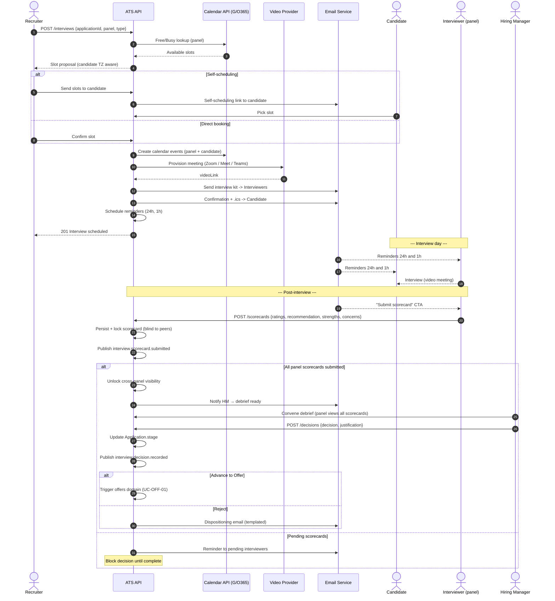

# Domain: Interviews & Hire Decision — `spec.md`

> **Source of requirements:** [`../../AGENTS.md`](../../AGENTS.md) · [Master catalog](../README.md)
> **Last updated:** 2026-05-23

---

## 1. Domain Summary

Owns the **end of the evaluation funnel**: interview scheduling, kit distribution, structured scorecard capture, collaborative debrief and the **final hire / no-hire decision**. This is where applications convert into hires — the biggest lever on time-to-hire and on quality-of-hire.

**In scope:**
- Interview request and scheduling (phone screen, technical, panel, onsite loop, hiring manager).
- Calendar sync (Google Workspace / Microsoft 365) with Free/Busy lookup.
- Candidate self-scheduling (slot picker, time-zone aware).
- Video meeting link provisioning (Zoom / Microsoft Teams / Google Meet).
- Interview kits (JD snapshot, candidate context, rubric, question bank).
- Reminders to candidate and interviewers (24h, 1h).
- Structured scorecards (rubric-based ratings + recommendation).
- Collaborative debrief and hire / no-hire decision recording.

**Out of scope:** asynchronous one-way video interviews (handled by integrations), coding assessments (domain `screening`), offer letter generation (domain `offers`).

---

## 2. Roles Involved

| Role | Capabilities |
|---|---|
| Recruiter | Creates the request, builds the panel, owns logistics, manages reschedules |
| Candidate | Picks slot, confirms, reschedules |
| Interviewer | Receives interview kit, conducts the interview, submits scorecard |
| Hiring Manager | Runs the debrief, records the final hire / no-hire decision |
| System | Calendar sync, video link provisioning, reminders, scorecard locking |

---

## 3. Use Cases in this Domain

| ID | Use case | Actor | Priority | Depends on |
|---|---|---|---|---|
| UC-INT-01 | Schedule interview (with calendar sync) | Recruiter | P0 | UC-AUTH-03 (calendar OAuth) |
| UC-INT-02 | Candidate self-schedules / reschedules | Candidate | P0 | UC-INT-01 |
| UC-INT-03 | Send interview kit to interviewer | System | P0 | UC-INT-01 |
| UC-INT-04 | Send automated reminders | System | P0 | UC-INT-01 |
| UC-INT-05 | Video meeting provisioning (Zoom / Teams / Meet) | System | P0 | UC-INT-01 |
| UC-INT-06 | Submit structured scorecard | Interviewer | P0 | UC-INT-01 |
| UC-INT-07 | Collaborative debrief | Hiring Manager + Panel | P0 | UC-INT-06 |
| UC-INT-08 | Record hire / no-hire decision | Hiring Manager | P0 | UC-INT-07 |
| UC-INT-09 | Cancel / reschedule from internal side | Recruiter | P1 | UC-INT-01 |
| UC-INT-10 | Manage interview kit & rubric library | Admin | P1 | — |

---

## 4. Detailed Use Case — UC-INT-01 → UC-INT-08: Schedule, evaluate, decide

**Primary actors:** Recruiter (scheduling), Interviewer (scorecard), Hiring Manager (decision)
**Secondary actors:** Candidate, System (calendar, video, mail)

### Preconditions
- `Application` is at the `Interview` stage (or being advanced to it).
- Interviewer(s) have a connected calendar (Google / Microsoft OAuth).
- Interview kit is configured for the stage (rubric + question bank).

### Main flow — Scheduling
1. Recruiter opens the `Application` and clicks **Schedule interview**.
2. Selects the **interview type** (Phone screen, Technical, Onsite panel, Hiring Manager) and the **interviewer(s)**.
3. System runs **Free/Busy lookup** across interviewers' calendars (and recruiter's, if observing).
4. System proposes compatible slots, honoring the **candidate's time zone** and per-interviewer working-hours policy.
5. Recruiter chooses between: **propose slots to candidate** (self-scheduling) or **book directly**.
6. Self-scheduling path:
   1. System emails the candidate a self-scheduling link.
   2. Candidate picks a slot (UC-INT-02); System holds-tentative on all calendars during selection.
7. System creates the calendar event on interviewer and candidate calendars (`.ics`).
8. System provisions a **video meeting** via the configured integration (Zoom / Meet / Teams) and embeds the link in the calendar event.
9. System sends the **interview kit** to each interviewer (UC-INT-03): candidate CV, JD snapshot, previous-stage scorecards (if permitted by anti-bias policy), rubric pre-loaded, suggested questions.
10. System schedules **reminders** (UC-INT-04): 24h and 1h before to all attendees; SMS optional for candidate.
11. UI confirms the schedule and renders the timeline on the `Application`.

### Main flow — Scorecard & Decision
12. After the scheduled end time, System emails / pings the interviewer with a **"Submit scorecard"** CTA.
13. Interviewer opens the structured scorecard:
    - Per-competency rubric ratings (1–5 with anchors + free-text comments).
    - Overall **recommendation**: `Strong Hire` / `Hire` / `No Hire` / `Strong No Hire`.
    - Required strengths/concerns text fields.
14. Interviewer submits; System persists, **locks** the scorecard (no edits) and publishes `interview.scorecard.submitted`.
15. **Blind debrief gating:** scorecards are not visible across interviewers until **all panel members have submitted** (anti-anchoring bias).
16. When all panel scorecards are in, System notifies the Hiring Manager for **debrief** (UC-INT-07).
17. Debrief: panel reviews scorecards together, surfaces disagreement, calibrates.
18. Hiring Manager records the **final decision** (UC-INT-08): `Advance` (to next stage / offer), `Reject`, `Hold`, or `Strong Yes → Offer`, with justification.
19. System updates `Application.stage` accordingly and publishes `interview.decision.recorded`.

### Alternative flows
- **A1. No common availability** → widen the time window, add manual slots, or suggest rescheduling.
- **A2. Candidate reschedules** → System cancels the event, re-books, regenerates kits and reminders.
- **A3. Interviewer declines the slot** → notify Recruiter to reassign.
- **A4. Late scorecard (>48h)** → escalate reminder to Hiring Manager; block decision until complete.
- **A5. No video integration configured** → Recruiter enters a manual conferencing link.
- **A6. Cancellation** → cancel calendar event, free up slots, notify all attendees, log reason.
- **A7. Split panel decision** → debrief mandatory; HM records final call with justification.

### Postconditions
- `Interview` records persisted and linked to `Application`.
- Scorecards persisted, locked, and linked to interviewers.
- Final decision recorded; `Application.stage` advanced or candidate dispositioned.
- `interview.*` events published.
- Analytics updated: time-in-stage, no-show rate, interviewer load, panel calibration metrics.

### Business rules
- No bookings outside the interviewer's configured working hours.
- Mandatory buffer between interviews (configurable, default 15 min).
- A panel is "evaluated" only when **all** scorecards are submitted (no partial decisions).
- The final hire decision can only be recorded by a Hiring Manager (or senior Recruiter with override permission).
- **Blind-scorecard policy** is enforced by default and configurable per tenant.
- Reminders are mandatory and non-opt-out to reduce no-show rate.
- Every decision retained with author, timestamp, justification for 7 years (compliance / audit).

### Key data model
```
Interview {
  id, applicationId, type, status,
  scheduledAt, durationMin, timezone, videoLink, location?
}
InterviewParticipant {
  interviewId, userId, role: INTERVIEWER|RECRUITER|OBSERVER, calendarEventId
}
InterviewKit { interviewId, jdSnapshot, rubric[], questions[], priorScorecardsVisible }
Scorecard {
  interviewId, interviewerId, ratings[{competency, score, comments}],
  overallRecommendation, strengths, concerns, submittedAt, locked
}
HireDecision {
  applicationId, decidedBy, decision, justification, decidedAt
}
```

---

## 5. Diagram (Mermaid) — Schedule → Interview → Scorecard → Debrief → Decision



---

## 6. Cross-Cutting Business Rules

- **Anti-bias / blind scorecards:** scorecards are NOT visible across interviewers until all panel members have submitted (prevents anchoring).
- **Calendar conflicts:** detect and block double-bookings; respect interviewer load caps.
- **Audit trail:** every decision is stored with author, timestamp and justification.
- **Accessibility:** the self-scheduling page must be mobile-first and WCAG 2.1 AA compliant.
- **Time zones:** always persist in UTC and render in the viewer's local time zone.
- **Interviewer training gating:** in tenants with structured-hiring enforcement, only certified interviewers can be added to panels (configurable).

---

## 7. Published Events

| Event | Consumers |
|---|---|
| `interview.scheduled` | Analytics, Communications, Automation |
| `interview.rescheduled` / `interview.cancelled` | Calendar sync, Communications |
| `interview.kit.sent` | Analytics |
| `interview.reminder.sent` | Analytics |
| `interview.scorecard.submitted` | UI, HM notifications, Analytics |
| `interview.debrief.opened` | Analytics |
| `interview.decision.recorded` | Application stage update, Offers, Analytics |

---

## 8. Open Questions

- Support asynchronous one-way video interviews in MVP? Proposal: P2, delivered via integration.
- Allow the candidate to counter-propose their own slots? Proposal: P1.
- Blind-scorecard policy: enforce per tenant or always-on? Proposal: always-on by default, off only with admin override.
- Interviewer calibration analytics (rating drift vs. cohort) — Proposal: P2.
