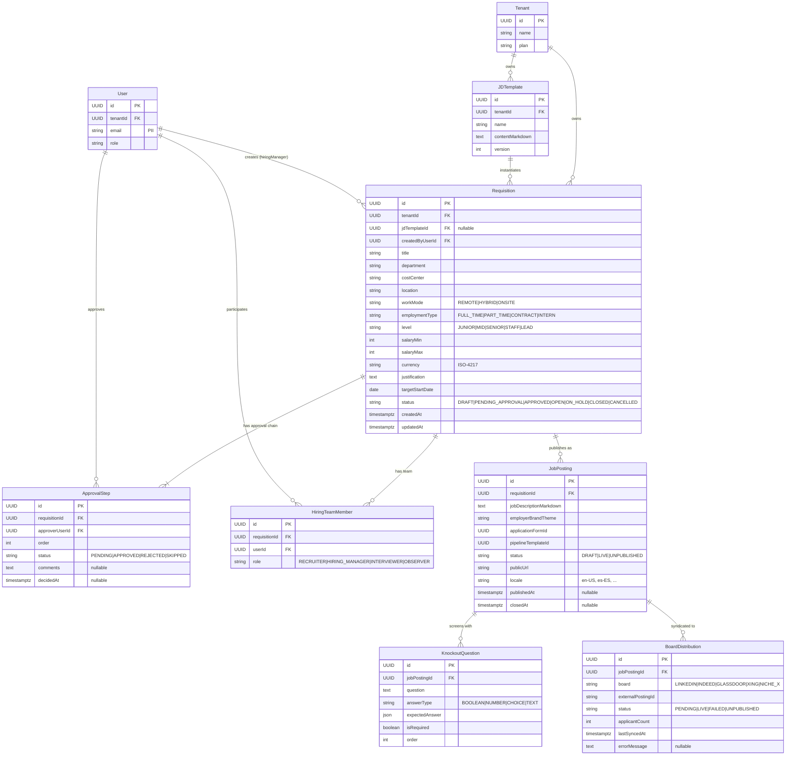

# Domain: Requisitions & Job Posting — `design.md`

> **Companion to:** [`spec.md`](spec.md)
> **Scope:** data model (entities, attributes, relationships) for the Requisitions & Job Posting domain.
> **Last updated:** 2026-05-23

---

## 1. Conventions

- **Identifiers:** every entity has `id : UUID` (PK). Foreign keys named `<entity>Id`.
- **Multi-tenancy:** every top-level entity carries `tenantId : UUID`.
- **Timestamps:** `createdAt`, `updatedAt` (TIMESTAMPTZ, UTC).
- **Enums:** rendered as inline comments; persisted as constrained strings or DB enums.
- **Cardinality (Mermaid ER):** `||--o{` 1-to-many · `||--||` 1-to-1 · `||--|{` 1-to-one-or-many.
- **PII** is flagged in field comments.

---

## 2. Referenced Cross-Cutting Entities

Owned by the platform, referenced (FK only) by this domain.

| Entity | Why referenced |
|---|---|
| `Tenant` | Multi-tenancy boundary for every requisition. |
| `User` | Creator, approver, hiring-team member. |

---

## 3. Domain Entities

| Entity | Description |
|---|---|
| `Requisition` | Internal, approved request to hire for a role. |
| `JDTemplate` | Reusable job-description template. |
| `HiringTeamMember` | User assigned to a requisition (recruiter, hiring manager, panel). |
| `ApprovalStep` | One node in the approval chain — snapshot taken at submission time. |
| `JobPosting` | Public-facing publication derived from a requisition. |
| `KnockoutQuestion` | Mandatory pre-screening question attached to a posting. |
| `BoardDistribution` | Per-job-board syndication record (LinkedIn, Indeed, etc.). |

---

## 4. ER Diagram

---

## 5. Key Cardinality Rules

| Relation | Cardinality | Note |
|---|---|---|
| `Requisition → ApprovalStep` | 1 : N | Snapshot at submit — later org changes don't break in-flight reqs. |
| `Requisition → JobPosting` | 1 : N | One req can have N postings (locales, regions). |
| `JobPosting → KnockoutQuestion` | 1 : N | Optional pre-screening rules. |
| `JobPosting → BoardDistribution` | 1 : N | One row per syndicated board. |

---

## 6. Lifecycle Invariants

1. A `JobPosting` can only exist when its `Requisition.status = APPROVED` (or later).
2. `Requisition.status` transitions are linear: `DRAFT → PENDING_APPROVAL → APPROVED → OPEN → (ON_HOLD | CLOSED | CANCELLED)`.
3. Closing a `Requisition` cascades: every `JobPosting.status` becomes `UNPUBLISHED` within 24h and `BoardDistribution` rows are unpublished externally.
4. `ApprovalStep` rows are append-only after creation; comments can be added but `status` is immutable once decided.

---

## 7. Boundary with Other Domains

- **Outbound:** `JobPosting.id` is the FK consumed by `Application` (see [candidates/design.md](../candidates/design.md)) — this is the join point with the Candidates domain.
- **Outbound:** `KnockoutQuestion.id` is consumed by `KnockoutResponse` in the Candidates domain.

---

## 8. Open Questions

- `PipelineTemplate` as first-class entity vs. JSON on `JobPosting`? Proposal: first-class once templates are reused across postings.
- Programmatic job advertising (auto-bid) — needs a `BoardCampaign` entity in P2.
- Localization: model translations as `JobPostingLocale` child entity or one `JobPosting` row per locale? Currently modeled as one row per locale.
