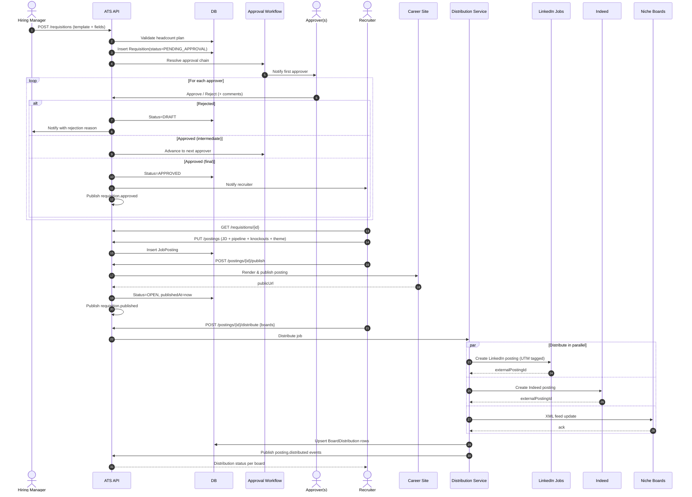

# Domain: Requisitions & Job Posting — `spec.md`

> **Source of requirements:** [`../../AGENTS.md`](../../AGENTS.md) · [Master catalog](../README.md)
> **Last updated:** 2026-05-23

---

## 1. Domain Summary

Owns the **opening of a role**: requisition intake, approval workflow, job description, publication to the branded career site, and multi-board distribution. This is the **origin of the hiring funnel** — no candidates exist until a requisition becomes a live job posting.

**In scope:**
- Requisition intake (Hiring Manager request) and job-description authoring (templates, JD library).
- Multi-stage approval workflow (Finance, HR, Exec) tied to headcount plan.
- Career-site publication with employer-branding theme.
- Multi-board distribution (LinkedIn, Indeed, Glassdoor, niche boards) via aggregator or native integrations.
- Social recruiting share, internal job board.
- Requisition lifecycle: `Draft → Pending Approval → Approved → Open → On Hold → Closed → Cancelled`.

**Out of scope:** candidate application flow (domain `candidates`), sourcing campaigns (domain `sourcing`), offer (domain `offers`).

---

## 2. Roles Involved

| Role | Capabilities |
|---|---|
| Hiring Manager | Submits requisition request, picks JD template, defines hiring team |
| Recruiter | Refines JD, configures pipeline, publishes job, manages distribution |
| Approver (Finance / HR / Exec) | Approves or rejects requisition |
| Admin / Talent Ops | Manages JD templates, approval chains, board credentials |
| System | Triggers approval routing, distributes to boards, tracks board-level metrics |

---

## 3. Use Cases in this Domain

| ID | Use case | Actor | Priority | Depends on |
|---|---|---|---|---|
| UC-REQ-01 | Create requisition from template | Hiring Manager | P0 | — |
| UC-REQ-02 | Approve / reject requisition | Approver | P0 | UC-REQ-01 |
| UC-REQ-03 | Publish job to career site | Recruiter | P0 | UC-REQ-02 |
| UC-REQ-04 | Distribute to job boards (LinkedIn, Indeed, etc.) | Recruiter | P1 | UC-REQ-03 |
| UC-REQ-05 | Share on social channels (LinkedIn, X, Facebook) | Recruiter | P1 | UC-REQ-03 |
| UC-REQ-06 | Publish to internal job board | Recruiter | P1 | UC-REQ-03 |
| UC-REQ-07 | Close / pause / cancel requisition | Recruiter | P0 | UC-REQ-03 |
| UC-REQ-08 | Reopen requisition | Recruiter | P1 | UC-REQ-07 |
| UC-REQ-09 | Manage JD template library | Admin | P1 | — |
| UC-REQ-10 | Configure approval chain | Admin | P0 | — |

---

## 4. Detailed Use Case — UC-REQ-01 → UC-REQ-04: From requisition request to multi-board distribution

**Primary actors:** Hiring Manager (intake), Recruiter (publication), Approver (governance)
**Secondary actors:** System (approval routing, board distribution), Job Boards

### Preconditions
- Hiring Manager is authenticated and assigned to a team with open headcount.
- Approval chain configured for the department / cost center.
- (For UC-REQ-04) Board integrations (LinkedIn Recruiter, Indeed, etc.) configured at tenant level with valid credentials.

### Main flow — Intake & Approval
1. Hiring Manager opens **Requisitions → New Requisition** and selects a **JD template** (or starts blank).
2. Fills out: job title, department, location (remote / hybrid / onsite), employment type, level, salary band, hiring team (recruiter, panel), target start date, business justification.
3. System validates against the **headcount plan** (open seats vs. plan).
4. Hiring Manager submits → status becomes `Pending Approval`.
5. System resolves the **approval chain** (e.g., Finance → HR Director → CEO for senior roles) and notifies the first approver.
6. Each approver reviews and approves / rejects with comments.
7. On final approval → status becomes `Approved` and the owning Recruiter is notified.
8. System emits `requisition.approved` event.

### Main flow — Publication & Distribution
9. Recruiter opens the approved requisition and clicks **Publish**.
10. Refines the public-facing JD (markdown editor, employer-brand snippets, EEO statement, salary disclosure for compliant jurisdictions: CA, CO, NY, WA).
11. Configures the **hiring pipeline stages** (or accepts template) and **knockout questions**.
12. Picks the **career-site theme** (department / brand variant) and the application form.
13. Clicks **Publish to career site** → posting goes live, status `Open`, public URL minted.
14. (Optional) Clicks **Distribute** and selects target boards: LinkedIn Jobs, Indeed (organic + sponsored), Glassdoor, niche boards.
15. System pushes the posting via each board's API (or XML feed for aggregators), captures `externalPostingId` per board.
16. System tracks **source-of-application** automatically via UTM tags on each board's URL.
17. UI shows distribution status per board (Live, Pending, Failed) and applicant counts per source.

### Alternative flows
- **A1. Headcount plan exceeded** → block submission with link to budget owner.
- **A2. Approver rejects** → status returns to `Draft` with rejection comment; Hiring Manager edits and resubmits.
- **A3. Approval timeout** → System auto-escalates after configured SLA (e.g., 3 business days).
- **A4. Board distribution fails** (auth error, JD content rejected) → posting stays live on career site, Recruiter sees per-board error with remediation.
- **A5. Pay-transparency jurisdiction** → System enforces salary range field before publish.
- **A6. Hold / Cancel / Close** → posting is unpublished from boards and career site; events emitted.

### Postconditions
- `Requisition` and `JobPosting` persisted.
- Posting is live on career site (and optionally on N boards).
- `requisition.published` and `posting.distributed.{board}` events published.
- Source-of-application tracking active for downstream attribution.

### Business rules
- Every requisition must reference a cost center and a hiring manager.
- Approval chain is **resolved at submission time** (snapshot) so later org changes don't break in-flight requisitions.
- JD must include EEO statement and, where required by law, salary range.
- Closing a requisition automatically unpublishes from all boards within 24h.
- Audit trail: every approval / publish / distribute action retained for 7 years.

### Key data model
```
Requisition {
  id, tenantId, title, department, costCenter, location, employmentType, level,
  salaryBand, hiringTeam[], targetStartDate, justification,
  status, approvalChain[], approvalState, createdBy, createdAt
}
JobPosting {
  id, requisitionId, jobDescription, employerBrandTheme, applicationFormId,
  pipelineTemplateId, knockoutQuestions[], publishedAt, closedAt, publicUrl
}
BoardDistribution {
  id, postingId, board, externalPostingId, status, lastSyncedAt, applicantCount
}
```

---

## 5. Diagram (Mermaid) — Requisition Intake → Approval → Multi-Board Distribution



---

## 6. Cross-Cutting Business Rules

- **Source-of-hire attribution:** every board URL is UTM-tagged; applicant source is captured automatically and used in analytics.
- **Pay transparency:** posting enforces salary range when location matches a regulated jurisdiction (CA, CO, NY, WA, IL, MD, EU directive).
- **Internal-only roles:** option to publish to internal job board only (drives internal mobility).
- **Posting lifecycle:** automatic unpublish when requisition is closed/cancelled or when offer is accepted (configurable).
- **Localization:** posting can have multiple language variants; default + per-locale overrides.

---

## 7. Published Events

| Event | Typical consumers |
|---|---|
| `requisition.created` | Analytics, Audit |
| `requisition.approved` | Notifications, Audit, Headcount tracking |
| `requisition.rejected` | Notifications, Audit |
| `requisition.published` | Analytics, Sourcing campaigns |
| `posting.distributed.{board}` | Analytics, Cost tracking (sponsored postings) |
| `requisition.closed` / `cancelled` | Distribution service (unpublish), Analytics |

---

## 8. Open Questions

- Programmatic job advertising (auto-bid on sponsored slots based on application velocity) — MVP or P2? Proposal: P2.
- Native LinkedIn Recruiter Seat integration vs. RSC (Recruiter System Connect) — depends on partner program access.
- AI-assisted JD generation and bias detection (Textio-style) — Proposal: P1 add-on.
